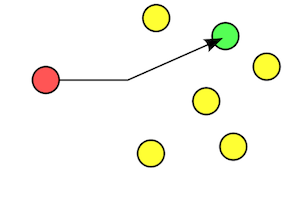
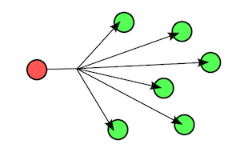
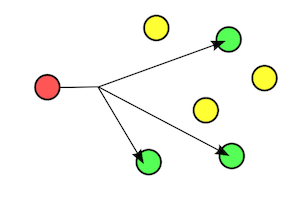

# kasync-swift

***Kasync*** is a library simplifying asynchronous programming in Swift.

[](https://github.com/andrey-kashaed/kasync-swift/releases/tag/0.2.3)
[](https://www.swift.org/blog/swift-5.8-released)

[](https://opensource.org/licenses/CDDL-1.0)

# Installation

The [Swift Package Manager](https://swift.org/package-manager/) automates the distribution of Swift code. To use ***Kasync*** with SPM, add a dependency to `https://github.com/andrey-kashaed/kasync-swift.git`

# Documentation

***Kasync*** library provides several components for different use cases related with asynchronous programming.

* [`Atomic`](#atomic): guarantees atomic execution for critical section of code preventing from concurrent access from different tasks.
* [`AtomicReference`](#atomic_reference): guarantees atomic operations for property value.
* [`Barrier`](#barrier): suspends asynchronous tasks until all required tasks reach this barrier.
* [`Fuse`](#fuse): protects throwable section of code from failure providing different backoff strategies.
* [`Gate`](#gate): represents asynchronous producer and consumer of arbitrary values.
* [`Mutex`](#mutex): guarantees atomic execution for critical section of code preventing from concurrent access from different tasks.
* [`Semaphore`](#semaphore): suspends async task execution until other party permits to proceed.
* [`Sluice`](#sluice): restricts number of asynchronous tasks which may execute certain section of code concurrently.
* [`UncheckedReference`](#unchecked_reference): help variable to be used in concurrently-executing code.

## <a id="atomic"></a> Atomic ##

`Atomic` is property wrapper guaranteeing atomic execution for critical section of code preventing from concurrent access from different tasks.

### Usage

```swift
func testAtomic() async throws {
    @Atomic var operation: @Sendable (_ param1: Int, _ param2: Int) async throws -> Int = { p1, p2 in
        print("Begin critical section")
        try await Task.sleep(for: .seconds(2))
        print("End critical section")
        return p1 * p2
    }
    async let result1: Int = operation(1, 2)
    async let result2: Int = operation(2, 3)
    print("[result1, result2] = \(try await [result1, result2])")
}
```

In this case console output will be like this:

```console
Begin critical section
End critical section
Begin critical section
End critical section
[result1, result2] = [2, 6]
.........
```

## <a id="atomic_reference"></a> AtomicReference ##

`AtomicReference` is property wrapper guaranteeing atomic read and write operations, as well as atomic custom synchronous operation for property value.

### Usage

```swift
@AtomicReference(1) var number
async let result1: Void = {
    for _ in 1...1_000_000 {
        let _ = await number^
    }
}()
async let result2: Void = {
    for _ in 1...1_000_000 {
        await number =^ Int.random(in: Int.min...Int.max)
    }
}()
async let result3: Void = {
    for _ in 1...1_000_000 {
        await number.atomic { $0 += 1 }
    }
}()
let _ = await [result1, result2, result3]
```

In this case we used `^` read non-blocking operator, `=^` write non-blocking operator and `atomic` non-blocking method for atomic synchonous operation. Because all these operations are atomic it prevents our code from data races.

## <a id="barrier"></a> Barrier ##

`Barrier` is a class suspending asynchronous tasks until all required tasks reach this barrier.

---

```swift
public init(requiredParties: Int, enabled: Bool = true)
```
> Creates an instance of `Barrier`. Parameter `requiredParties` specifies number of asynchronous tasks that must reach this barrier in order to proceed. Parameter `enabled` sets if barrier enabled or not.

---

```swift
public func await(enabledAfterCancellation: Bool = false) async throws
```
> Current task awaits all parties to proceed.

---

```swift
public func reset(enabled: Bool, error: Error = BarrierError.resetBarrier)
```
> Resets barrier throwing error for all awaiting asynchronous tasks.

---

### Usage

```swift
let barrier = Barrier(requiredParties: 3)
async let result1: Void = {
    try? await Task.sleep(for: .seconds(1))
    print("Task 1 will await")
    try? await barrier.await()
    print("Task 1 did await")
}()
async let result2: Void = {
    try? await Task.sleep(for: .seconds(2))
    print("Task 2 will await")
    try? await barrier.await()
    print("Task 2 did await")
}()
async let result3: Void = {
    try? await Task.sleep(for: .seconds(3))
    print("Task 3 will await")
    try? await barrier.await()
    print("Task 3 did await")
}()
let _ = await [result1, result2, result3]
```

In this case console output will be like this:

```console
Task 1 will await
Task 2 will await
Task 3 will await
Task 1 did await
Task 3 did await
Task 2 did await
.........
```

## <a id="fuse"></a> Fuse ##

`Fuse` is a class protecting throwable section of code from failure providing different backoff strategies.

---

```swift
public init(backoff: Backoff, timeoutFactor: Duration, tryLimit: Int)
```
> Creates an instance of `Fuse`. Parameter `backoff` is enum specifing corresponding backoff strategies: `.linear`, `.fibonacci` and `.exponential`. Parameter `timeoutFactor` is time multiplier for backoff strategy. Parameter `tryLimit` specifies number of tries until throwable section of code succeeds or `Fuse` itself fails.

---

```swift
public func protected<T>(_ operation: () async throws -> T) async rethrows -> T
```
> Protects throwable section of code from failure according to specified backoff strategy.

---

### Usage

```swift
let fuse = Fuse(backoff: .fibonacci, timeoutFactor: .seconds(1), tryLimit: 3)
enum RuntimeError: Error {
    case failedOperation
}
var i = 0
do {
    let _ = try await fuse.protected {
        i += 1
        print("Try #\(i)")
        if i < 3 {
            throw RuntimeError.failedOperation
        }
    }
    print("Success")
} catch {
    print("Failure")
}
```

In this case console output will be like this:

```console
Try #1
Try #2
Try #3
Success
.........
```

However in case if `tryLimit` was `2` console output would be like this:

```console
Try #1
Try #2
Failure
.........
```

## <a id="gate"></a> Gate ##
`Gate` is a class representing asynchronous producer and consumer of arbitrary values, and implements `Drain<Input, Output>` and `Source<Input, Output>` protocols. `ConfinedDrain<Input, Output>` is class implementing only `Drain<Input, Output>` protocol. `ConfinedSource<Input, Output>` is class implementing only only `Source<Input, Output>` protocol. Thus `ConfinedDrain` cannot be cast into `Source`, `ConfinedSource` cannot be cast into `Drain`.

> **Note**: every `Gate` may be converted to `ConfinedDrain` or `ConfinedSource` by means of `toDrain` and `toSource` computed properties correspondingly, see [sample](#sample_conversion_confined_drain_source).

You can use `Gate` methods like `send` and `sender` in order to produce `Input` value. You can use `Gate` methods like `process` and `processor` in order to consume `Input` value, transform `Input` value to `Output` value, and after respond with `Output` value back to the producer's call site.
You can use `Gate` methods like `receive` and `receiver` in order to consume `Input` value, instantly respond with `Output` value back to the producer's call site, and after handle `Input` value.

> **Warning**: despite the fact that you can use any `Sendable` type as `Input` and `Output`, it's highly recommended to use Swift value types in order to comply with thread safety and prevent data races and race conditions.

---

```swift
 public init(mode: Mode, scheme: Scheme, capacity: Int)
```
> Creates an instance of `Gate`.

#### Parameters:

##### mode

> Defines three different enum cases: `cumulative`, `retainable` and `transient` each of witch has `capacity` parameter (maximum allowed number of `Input` values awaiting consumer). If number of `Input` values awaiting consumer exceeds `capacity` oldest values will be discarded from `Gate` queue.
> 
> ###### cumulative mode
> 
>  This mode allows `Input` value to be accumulated while waiting for consumption no matter if `Gate` has attached consumers or not.
> 
>
> ###### retainable mode
> 
> This mode allows `Input` value to be retained while waiting for consumption only if `Gate` has attached consumers.
> 
> ###### transient mode
> 
> This mode allows `Input` value to be consumed only if `Gate` has attached consumer which is ready to consume immediately, otherwise `Input` value will be discarded.

##### scheme

> Defines four different schemes: `unicast`, `broadcast`, `multicast`, `anycast`.

> ###### unicast scheme

> You can think about `unicast` scheme as *one-to-one* relationship between producer and consumer.

> [](https://en.wikipedia.org/wiki/Unicast)

> In this case every `Input` value produced by any producer will be consumed by consumer only when `producerId` and `consumerId` are the same.

> ###### broadcast scheme

> You can think about `broadcast` scheme as *one-to-all* relationship between producer and consumer.

> [](https://en.wikipedia.org/wiki/Broadcasting_(networking))

> In this case every `Input` value produced by any producer will be consumed by all consumers currently attached to the `Gate` no matter if some of them are currently busy.

> ###### multicast scheme

> You can think about `multicast` scheme as *one-to-many-of-many* relationship between producer and consumer.

> [](https://en.wikipedia.org/wiki/Multicast)

> In this case every `Input` value produced by any producer will be consumed by all consumers currently attached to the `Gate` which are ready to consume immediately.

> ###### anycast scheme

> You can think about `anycast` scheme as *one-to-one-of-many* relationship between producer and consumer.

> [](https://en.wikipedia.org/wiki/Anycast)

> In this case every `Input` value produced by any producer will be consumed by any consumer currently attached to the `Gate` which is ready to consume immediately.

##### capacity

> Maximum number of produced `Input` values waiting for consumption.

---

```swift
public func seal(_ error: Error)
```
> Seals gate disposing all producer and consumer operations. Parameter `error` will be thrown for all disposed operations, default value is `GateError.sealedGate`.

---

```swift
public func discardProducer(producerId: UInt64)
```
> Discards producer by `producerId` parameter.

---

```swift
public func discardConsumer(consumerId: UInt64)
```
> Discards consumer by `consumerId` parameter.

---

### Drain

`Drain` protocol has following methods for producing `Input` values.

---

```swift
public func send(producerId: UInt64, _ provider: @escaping () async throws -> Input) async throws -> Output
```
> Produces single `Input` value which may be consumed after, and returns responding single `Output` value.

---

```swift
public func sender(producerId: UInt64, provider: AsyncThrowingStream<Input, Error>) -> AsyncThrowingStream<Output, Error>
```
> Produces sequence of `Input` values which may be consumed after, and returns responding sequence of `Output` values.

---

### Source

`Source` protocol has following methods for consuming `Input` values.

---

```swift
public func process(consumerId: UInt64, spec: any Spec<Input>, operation: (Input) async throws -> Output) async throws -> Output
```
> Consumes single `Input` value, and responds (by means of `operation` closure) to producer with single `Output` value.

---

```swift
public func processor(consumerId: UInt64, spec: any Spec<Input>, operation: @escaping (Input) async throws -> Output) -> AsyncThrowingStream<Output, Error>
```
> Consumes sequence of `Input` values, and responds (by means of `operation` closure) to producer with corresponding sequence of `Output` values.
> 
> **Warning**: associated consumer is going to be attached to `Gate` during lifetime of the returning asynchronous sequence iterator.


---

```swift
public func receive(consumerId: UInt64, spec: any Spec<Input>, instantOutput: Output) async throws -> Input
```
> Consumes single `Input` value, and responds (by means of `instantOutput` parameter) to producer with single `Output` value.

---

```swift
public func receiver(consumerId: UInt64, spec: any Spec<Input>, instantOutput: Output) -> AsyncThrowingStream<Input, Error>
```
> Consumes sequence of `Input` values, and responds (by means of `instantOutput` parameter) to producer with corresponding sequence of `Output` values.
> 
> **Warning**: associated consumer is going to be attached to `Gate` during lifetime of the returning asynchronous sequence iterator.

---

### Usage

#### <a id="sample_conversion_confined_drain_source"></a> Sample: Gate conversion to ConfinedDrain or ConfinedSource ####

```swift
let gate = Gate<String, Void>(mode: .retainable, scheme: .anycast)
let drain: ConfinedDrain<String, Void> = gate.toDrain
let source: ConfinedSource<String, Void> = gate.toSource
```

#### <a id="produce_consume_vales"></a> Sample: produce and consume values ####

```swift
let gate: Gate<Float, String> = Gate(mode: .transient, scheme: .anycast)
Task.detached { // consumer task
    for try await output in gate.processor(operation: { "\($0)" } ) {
        print("output: \(output)")
    }
}
Task.detached { // producer task
    var i: Float = 0.0
    while true {
        try await Task.sleep(for: .seconds(1))
        let output = try await gate.send(i)
        print("output: \(output)")
        i += 1.0
    }
}
```

In this case console output will be like this:

```console
output: 0.0
output: 0.0
output: 1.0
output: 1.0
output: 2.0
output: 2.0
.........
```

We have duplicated printed values because we basically print the same output value from producer `Task` and consumer `Task` as well. Output in `let output = try await gate.send(i)` will be returned from `send` method only after `operation` closure finishes its execution after transformation of `Input` value to `Output` value.

## <a id="mutex"></a> Mutex ##

`Mutex` is an actor guaranteeing atomic execution for critical section of code and preventing from concurrent access from different tasks.

---

```swift
public init()
```
> Creates an instance of `Mutex`.

---

```swift
public func atomic<R: Sendable>(_ operation: @Sendable () throws -> R) async rethrows -> R
```
> Performs synchronous `operation` atomically.

---

```swift
public func atomic<R: Sendable>(_ operation: @Sendable () async throws -> R) async rethrows -> R
```
> Performs asynchronous `operation` atomically.

---

### Usage

```swift
let mutex = Mutex()
async let result1: Void = {
    await mutex.atomic {
        print("Task 1 begin critical section")
        try? await Task.sleep(for: .seconds(2))
        print("Task 1 end critical section")
    }
}()
async let result2: Void = {
    await mutex.atomic {
        print("Task 2 begin critical section")
        try? await Task.sleep(for: .seconds(2))
        print("Task 2 end critical section")
    }
}()
async let result3: Void = {
    await mutex.atomic {
        print("Task 3 begin critical section")
        try? await Task.sleep(for: .seconds(2))
        print("Task 3 end critical section")
    }
}()
let _ = await [result1, result2, result3]
}
```

In this case console output will be like this:

```console
Task 1 begin critical section
Task 1 end critical section
Task 2 begin critical section
Task 2 end critical section
Task 3 begin critical section
Task 3 end critical section
.........
```

## <a id="semaphore"></a> Semaphore ##

`Semaphore` is a class suspending async task execution until other party permits to proceed. `Semaphore` increases `permits` number by means of `signal` method and decreases `permits` number by means of `await` method. If `permits` number is zero then `await` method call suspends current task at this point and cannot proceed until `permits` is larger than zero.

---

```swift
public init(initialPermits: Int, enabled: Bool = true)
```
> Creates an instance of `Semaphore`. Parameter `initialPermits` specifies initial number of permits. Parameter `enabled` sets if semaphore enabled or not.

---

```swift
public func await(enabledAfterCancellation: Bool = false) async throws
```
> Current task awaits when permits number is larger than zero or decreases permits number by one.

---

```swift
public func signal() throws
```
> Increases permits number by one.

---

```swift
public func signal(permits: Int) throws
```
> Increases permits number by `permits`.

---

```swift
public func reset(enabled: Bool, error: Error = BarrierError.resetBarrier)
```
> Resets semaphore throwing `error` for all awaiting asynchronous tasks. Parameter `enabled` sets if semaphore enabled or not.

---

### Usage

```swift
let semaphore = Semaphore(initialPermits: 0)
async let result1: Void = {
    print("Task 1 will await")
    try? await semaphore.await()
    print("Task 1 did await")
}()
async let result2: Void = {
    try? await Task.sleep(for: .seconds(3))
    print("Task 2 do signal")
    try? semaphore.signal()
}()
let _ = await [result1, result2]
```

In this case console output will be like this:

```console
Task 1 will await
Task 2 do signal
Task 1 did await
.........
```

## <a id="sluice"></a> Sluice ##

`Sluice` is a class restricting number of asynchronous tasks which may execute certain section of code concurrently.

---

```swift
public init(passCapacity: Int)
```
> Creates an instance of `Sluice`. Parameter `passCapacity` specifies number of asynchronous tasks that are allowed to access the critical section of code. In case when `passCapacity = 1` `Sluice` acts like asynchronous mutex.

---

```swift
public func restricted<T>(_ operation: @Sendable () async throws -> T) async rethrows -> T
```
> Restricts the critical section of code represented with `operation`.

---

### Usage

```swift
let sluice = Sluice(passCapacity: 2)
async let result1: Void = {
    await sluice.restricted {
        print("Task 1 begin restricted section")
        try? await Task.sleep(for: .seconds(2))
        print("Task 1 end restricted section")
    }
}()
async let result2: Void = {
    await sluice.restricted {
        print("Task 2 begin restricted section")
        try? await Task.sleep(for: .seconds(2))
        print("Task 2 end restricted section")
    }
}()
async let result3: Void = {
    await sluice.restricted {
        print("Task 3 begin restricted section")
        try? await Task.sleep(for: .seconds(2))
        print("Task 3 end restricted section")
    }
}()
let _ = await [result1, result2, result3]
```

In this case console output will be like this:

```console
Task 1 begin restricted section
Task 2 begin restricted section
Task 2 end restricted section
Task 1 end restricted section
Task 3 begin restricted section
Task 3 end restricted section
.........
```

## <a id="unchecked_reference"></a> UncheckedReference ##

`UncheckedReference` is a property wrapper helping variable to be used in concurrently-executing code.

### Usage

```swift
@UncheckedReference var number = 0
let mutex = Mutex()
async let result1: Void = {
    for _ in 1...1_000_000 {
        await mutex.atomic {
            $number =^ number + 1
        }
    }
}()
async let result2: Void = {
    for _ in 1...1_000_000 {
        await mutex.atomic {
            $number =^ number + 1
        }
    }
}()
async let result3: Void = {
    for _ in 1...1_000_000 {
        await mutex.atomic {
            $number =^ number + 1
        }
    }
}()
let _ = await [result1, result2, result3]
print("number = \(number)")
```

So that we could use captured `var` in concurrently-executing code. In this case console output will be like this:

```console
number = 3000000
.........
```