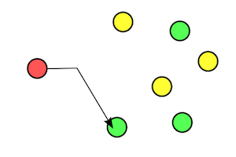

# kasync-swift

***Kasync*** is a library simplifying asynchronous programming in Swift.

[](https://github.com/andrey-kashaed/kasync-swift/releases/tag/0.1.0)
[](https://www.swift.org/blog/swift-5.7-released)

[](https://opensource.org/licenses/CDDL-1.0)

# Installation

The [Swift Package Manager](https://swift.org/package-manager/) automates the distribution of Swift code. To use ***Kasync*** with SPM, add a dependency to `https://github.com/andrey-kashaed/kasync-swift.git`

# Documentation

***Kasync*** library provides several components for different use cases related with asynchronous programming.

* [`Gate`](#gate): represents asynchronous producer and consumer of arbitrary values.
* [`Sluice`](#sluice): protects critical section of code from simultaneous access from different asynchronous tasks.
* [`Barrier`](#barrier): suspends asynchronous tasks until all other tasks reach this barrier.
* [`Fuse`](#fuse): protects critical section of code from failure providing different backoff strategies.

## <a id="gate"></a> Gate ##
`Gate` is a class representing asynchronous producer and consumer of arbitrary values, and implements `Drain` and `Source` protocols. 

> **Note**: every `Gate` may be converted to `AnyDrain` or `AnySource` by means of `asDrain` and `asSource` computed properties correspondingly, see [sample](#sample_conversion_any_drain_source).

You can use `Gate` methods like `send` and `sender` in order to produce `Input` value. You can use `Gate` methods like `process` and `processor` in order to consume `Input` value, transform `Input` value to `Output` value, and after respond with `Output` value back to the producer's call site.
You can use `Gate` methods like `receive` and `receiver` in order to consume `Input` value, instantly respond with `Output` value back to the producer's call site, and after handle `Input` value.

> **Warning**: despite the fact that you can use any type as `Input` and `Output`, it's highly recommended to use Swift value types in order to comply with thread safety and prevent race conditions.

---

```swift
 public init(mode: Mode, scheme: Scheme)
```
> Creates an instance of `Gate`.

#### Parameters:

##### mode

> Defines three different enum cases: `cumulative`, `retainable` and `transient` each of witch has `capacity` parameter (maximum allowed number of `Input` values awaiting consumer). If number of `Input` values awaiting consumer exceeds `capacity` oldest values will be discarded from `Gate` queue.
> 
> ###### cumulative mode
> 
>  This mode allows `Input` value to be accumulated while waiting for consumption no matter if `Gate` has attached consumers or not.
> 
>
> ###### retainable mode
> 
> This mode allows `Input` value to be retained while waiting for consumption only if `Gate` has attached consumers.
> 
> ###### transient mode
> 
> This mode allows `Input` value to be consumed only if `Gate` has attached consumer which is ready to consume immediately, otherwise `Input` value will be discarded.

##### scheme

> Defines four different schemes: `unicast`, `broadcast`, `multicast`, `anycast`.

> ###### unicast scheme

> You can think about `unicast` scheme as *one-to-one* relationship between producer and consumer.

> [](https://en.wikipedia.org/wiki/Unicast)

> In this case every `Input` value produced by any producer will be consumed by consumer only when `producerId` and `consumerId` are the same.

> ###### broadcast scheme

> You can think about `broadcast` scheme as *one-to-all* relationship between producer and consumer.

> [](https://en.wikipedia.org/wiki/Broadcasting_(networking))

> In this case every `Input` value produced by any producer will be consumed by all consumers currently attached to the `Gate` no matter if some of them are currently busy.

> ###### multicast scheme

> You can think about `multicast` scheme as *one-to-many-of-many* relationship between producer and consumer.

> [](https://en.wikipedia.org/wiki/Multicast)

> In this case every `Input` value produced by any producer will be consumed by all consumers currently attached to the `Gate` which are ready to consume immediately.

> ###### anycast scheme

> You can think about `anycast` scheme as *one-to-one-of-many* relationship between producer and consumer.

> [](https://en.wikipedia.org/wiki/Anycast)

> In this case every `Input` value produced by any producer will be consumed by any consumer currently attached to the `Gate` which is ready to consume immediately.

---

```swift
public func seal(_ error: Error)
```
> Seals gate disposing all producer and consumer operations. Parameter `error` will be thrown for all disposed operations, default value is `GateError.sealedGate`.

---

```swift
public func discardProducer(producerId: UInt64)
```
> Discards producer by `producerId` parameter.

---

```swift
public func discardConsumer(consumerId: UInt64)
```
> Discards consumer by `consumerId` parameter.

---

### Drain

`Drain` protocol has following methods for producing `Input` values.

---

```swift
public func send(producerId: UInt64, _ provider: @escaping () async throws -> Input) async throws -> Output
```
> Produces single `Input` value which may be consumed after, and returns responding single `Output` value.

---

```swift
public func sender(producerId: UInt64, provider: AnyAsyncSequence<Input>) -> AnyAsyncSequence<Output>
```
> Produces sequence of `Input` values which may be consumed after, and returns responding sequence of `Output` values.

---

### Source

`Source` protocol has following methods for consuming `Input` values.

---

```swift
public func process(consumerId: UInt64, spec: TSpec<Input>, operation: (Input) async throws -> Output) async throws -> Output
```
> Consumes single `Input` value, and responds (by means of `operation` closure) to producer with single `Output` value.

---

```swift
public func processor(consumerId: UInt64, spec: TSpec<Input>, operation: @escaping (Input) async throws -> Output) -> AnyAsyncSequence<Output>
```
> Consumes sequence of `Input` values, and responds (by means of `operation` closure) to producer with corresponding sequence of `Output` values.
> 
> **Warning**: associated consumer is going to be attached to `Gate` during lifetime of the returning asynchronous sequence iterator.


---

```swift
public func receive(consumerId: UInt64, spec: TSpec<Input>, instantOutput: Output) async throws -> Input
```
> Consumes single `Input` value, and responds (by means of `instantOutput` parameter) to producer with single `Output` value.

---

```swift
public func receiver(consumerId: UInt64, spec: TSpec<Input>, instantOutput: Output) -> AnyAsyncSequence<Input>
```
> Consumes sequence of `Input` values, and responds (by means of `instantOutput` parameter) to producer with corresponding sequence of `Output` values.
> 
> **Warning**: associated consumer is going to be attached to `Gate` during lifetime of the returning asynchronous sequence iterator.

---

### Usage

#### <a id="sample_conversion_any_drain_source"></a> Sample: Gate conversion to AnyDrain or AnySource ####

```swift
let gate = Gate<String, Void>(mode: .retainable(), scheme: .anycast)
let drain: AnySource = gate.asSource
let drain: AnyDrain = gate.asDrain
```

#### <a id="produce_consume_vales"></a> Sample: produce and consume values ####

```swift
let gate: Gate<Float, String> = Gate(mode: .transient(), scheme: .anycast)
Task { // consumer task
    for try await output in gate.processor(operation: { "\($0)" } ) {
        print("output: \(output)")
    }
}
Task { // producer task
    var i: Float = 0.0
    while true {
        try await Task.sleep(for: .seconds(1))
        let output = try await gate.send(i)
        print("output: \(output)")
        i += 1.0
    }
}
```

In this case console output will be like this:

```console
output: 0.0
output: 0.0
output: 1.0
output: 1.0
output: 2.0
output: 2.0
.........
```

We have duplicated printed values because we basically print the same output value from producer `Task` and consumer `Task` as well. Output in `let output = try await gate.send(i)` will be returned from `send` method only after `operation` closure finishes its execution after transformation of `Input` value to `Output` value.

## <a id="sluice"></a> Sluice ##

`Sluice` is a class which protects critical section of code from simultaneous access from different asynchronous tasks.

---

```swift
public init(capacity: Int)
```
> Creates an instance of `Sluice`. Parameter `capacity` specifies number of asynchronous tasks that are allowed to access the critical section of code. In case of default `capacity` when `capacity = 1` `Sluice` acts like asynchronous mutex.

---

```swift
public func enter() async throws
```
> Attempts to enter the critical section of code.

---

```swift
public func exit()
```
> Exits the critical section of code.

---

```swift
public func synchronized<T>(_ closure: () async throws -> T) async throws -> T
```
> Synchronizes the critical section of code represented with `closure`.

---

### Usage

```swift
let sluice = Sluice(capacity: 1)
@Sendable func criticalSection() async throws {
    print("Begin critical section")
    try await Task.sleep(for: .seconds(1))
    print("End critical section")
}
Task {
    try await sluice.synchronized {
        try await criticalSection()
    }
}
Task {
    try await sluice.synchronized {
        try await criticalSection()
    }
}
Task {
    try await sluice.synchronized {
        try await criticalSection()
    }
}
```

In this case console output will be like this:

```console
Begin critical section
End critical section
Begin critical section
End critical section
Begin critical section
End critical section
.........
```

## <a id="barrier"></a> Barrier ##

`Barrier` for a group of asynchronous tasks in the source code means any task must be suspended at this point and cannot proceed until all other tasks reach this barrier.

---

```swift
public init(partiesCount: Int, mode: Mode)
```
> Creates an instance of `Barrier`. Parameter `partiesCount` specifies number of asynchronous tasks that must reach this barrier in order to proceed, default value is `Int.max`. Parameter `mode` is enum with two cases: `.auto` and `.manual`, default value is `.auto`. In case of `.manual` mode after all parties/tasks are able to reach this barrier and proceed, it's necessary to call `reset` method so this `Barrier` may be used again. In case of `.auto` mode there is no need to `reset` method in order to use `Barrier` again.

---

```swift
public func await() async throws
```
> Current task awaits all parties to proceed.

---

```swift
public func signal()
```
> Signals to all awaiting asynchronous tasks so they may proceed without waiting.

---

```swift
public func reset(error: Error)
```
> Resets barrier throwing error for all awaiting asynchronous tasks.

---

### Usage

```swift
let barrier: Barrier = Barrier(partiesCount: 3, mode: .manual)
Task {
    try await Task.sleep(for: .seconds(1))
    print("Task 1 will await")
    try await barrier.await()
    print("Task 1 did await")
}
Task {
    try await Task.sleep(for: .seconds(2))
    print("Task 2 will await")
    try await barrier.await()
    print("Task 2 did await")
}
Task {
    try await Task.sleep(for: .seconds(3))
    print("Task 3 will await")
    try await barrier.await()
    print("Task 3 did await")
}
```

In this case console output will be like this:

```console
Task 1 will await
Task 2 will await
Task 3 will await
Task 3 did await
Task 1 did await
Task 2 did await
.........
```


## <a id="fuse"></a> Fuse ##

`Fuse` is a class which protects critical section of code from failure providing different backoff strategies.

---

```swift
public init(backoff: Backoff, factor: Double, tryLimit: Int)
```
> Creates an instance of `Fuse `. Parameter `backoff` is enum specifing corresponding backoff strategies: `.linear`, `.fibonacci` and `.exponential`. Parameter `factor` is time multiplier for backoff strategy. Parameter `tryLimit` specifies number of tries until critical section of code succeeds or `Fuse` itself fails.

---

```swift
public func protected<T>(_ block: () async throws -> T) async rethrows -> T
```
> Protects critical section of code from failure according to specified backoff strategy.

---

### Usage

```swift
let fuse = Fuse(backoff: .fibonacci, factor: 1, tryLimit: 3)
Task {
    var i = 0
    do {
        let _ = try await fuse.protected {
            i += 1
            print("Try #\(i)")
            if i < 3 {
                throw RuntimeError()
            }
        }
        print("Success")
    } catch {
        print("Failure")
    }
}
```

In this case console output will be like this:

```console
Try #1
Try #2
Try #3
Success
.........
```

However in case if `tryLimit` was `2` console output would be like this:

```console
Try #1
Try #2
Failure
.........
```
